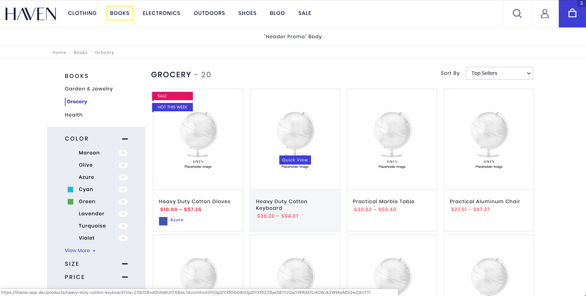
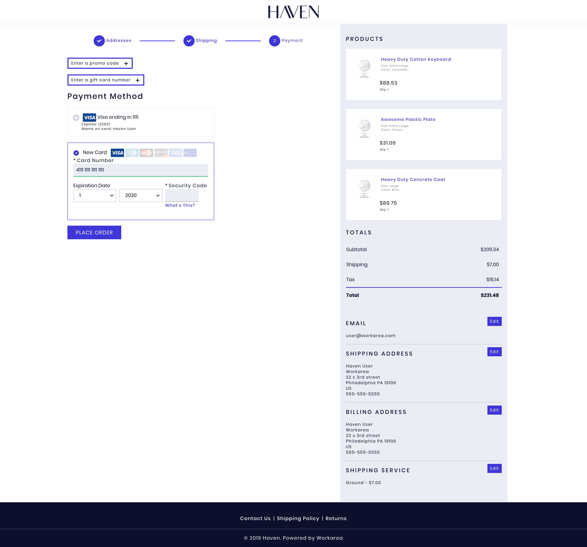

# Workarea Haven Theme

Haven - a sleek, modern theme for the Workarea platform.

[Documentation for workarea themes on homebase](https://homebase.weblinc.com/plugins/theme)

## Screenshots

Category browse page


Product detail page


Checkout


More screenshots available in /public/screenshots within the repository.

## Browser Support

Based on current browser usage statistics Haven Theme supports evergreen browsers and IE11+ see the browserlist file for specifics.

* Note that Haven Theme uses flexbox, if you need to support IE10 or lower significant changes to styles may be requried
* Haven theme uses position: sticky; for the sticky header. This does not work in IE11 but has been deemed as progressive enhancement. A polyfill can be used to make the header stick in IE11 if necessary.

## Notable features

* Sticky header - note this feature is not supported by IE11

## Optimal Image Sizes

| Image Type| Optimum size | Note |
|----------|--------|-------|
| Logo | 140 x 37px ||
| Product Images | 2400 x 2400 | This size accounts for use of image-zoom |
| Product Images - no zoom | 1200 x 1200 | Minimum image size if you are not using zoom |
| Product Grid Content (1 cell) | 272px x 400px | Background image for product grid content block |
| Product Grid Content (2 cells) | 552px x 400px | Background image for product grid content block spanning 2 grid cells |
| Swatch Images | 32px x 32px | Images used for swatch display |
| Blog Thumbnail | 353px x 172px | Displayed in blog entry summaries, and the featured entry content block |
| Blog Header Image | 1112px x 544px | Image content blocks can be added to the blog entry 'blog header' content area |

## Out of the box plugin support

The following workarea plugins are supported by Haven, and are dependencies of the plugin.

* Product Quickview
* Package Products
* Product Badges
* Product Videos
* Product Image Zoom
* Product Grid Content
* Swatches
* Reviews
* Blog
* Content Search
* Styled selects
* Email Signup Popup
* Shipping Message
* Gift Cards
* Share

## Theme Configuration

### Recommended initializer configuration

While you are able to configure Workarea themes from any initializer it is recommended
that you create a new initializer called theme.rb using the following code

```ruby
Workarea.configure do |config|
  config.theme = config.theme.merge(
    color_scheme: "haven",
    primary_font_family: "poppins",
    secondary_font_family: "pt_serif"
  )
end
```

This will set your application up with the default configuration options, but allow you to
change them easily.

---

### Color Schemes

Haven comes with [TODO] color schemes pre-defined for demo and learning purposes.

To change the color scheme in your application, set the color_scheme configuration
in your theme initializer to one of the following configurations:

Default:

    Workarea.config.theme[:color_scheme] = "haven"

#### Creating a new color scheme

We will be creating a gem for theme infastructure in the near future that will make this process
more developer friendly. In the meantime you can create a new color scheme by:

1. Copying one of the existing color scheme files into your application re-nameing the file,
2. Update the color_scheme config to match the name of your new color scheme file.

__Example__
This will create a sass file called _custom_color_scheme.scss in your host application, please change <your-app-name>
From your ~/src directory, ensure you have workarea-haven-theme pulled down

    cp -i workarea-haven-theme/app/assets/stylesheets/workarea/storefront/theme_config/_haven_color_scheme.scss <your-app-name>/app/assets/stylesheets/workarea/storefront/theme_config/_custom_color_scheme.scss

### Font Stacks

Haven Theme includes configurable font-stack functionality!

A developer is able to configure the primary and secondary font stacks using the theme
configuration initializer. To change the font stacks in your application set the
primary_font_family and secondary_font_family initializer values to one of the font_stacks
defined in workarea-haven-theme/config/initializers/theme.rb

Example:

```ruby
config.theme = config.theme.merge(
  primary_font_family: "poppins",
  secondary_font_family: "pt_serif"
)
```

The primary_font_family is used for most text throughout the site, including body text, links,
buttons, prices, content blocks etc.
The secondary_font_family is used for content headings only.

#### Adding a new font

I recommend using google fonts where possible, the [googlefonts webfont helper](https://google-webfonts-helper.herokuapp.com) is a useful tool for downloading webfonts and easily generating @font-face CSS - give it a try!

1. Create a new directory in app/assets/fonts/workarea/storefront/<your_font_name_here>
2. Download woff and woff2 files for the font you want to use.
3. Place your font files in the directory we created in step 1.
4. Create a sass file for you @font-face declarations in /app/assets/stylesheets/workarea/storefront/theme_config/fonts/_<your_font_name_here>.scss
5. Update your theme initializer, adding a new font_stack and setting either the primary_font_family or secondary_font_family

Example configuration for Calibri font stack used as secondary font family:

```ruby
config.theme[:font_stacks] = config.theme.font_stacks.merge (
  calibri: 'Calibri, Candara, Segoe, "Segoe UI", Optima, Arial, sans-serif',
)

config.theme = config.theme.merge(
  secondary_font_family: "calibri"
)
```

## Getting Started

This gem contains a rails engine that must be mounted onto a host Rails application.

To access Workarea gems and source code, you must be an employee of WebLinc or a licensed retailer or partner.

Workarea gems are hosted privately at https://gems.weblinc.com/.
You must have individual or team credentials to install gems from this server. Add your gems server credentials to Bundler:

    bundle config gems.weblinc.com my_username:my_password

Or set the appropriate environment variable in a shell startup file:

    export BUNDLE_GEMS__WEBLINC__COM='my_username:my_password'

Then add the gem to your application's Gemfile specifying the source:

    # ...
    gem 'workarea-haven_theme', source: 'https://gems.weblinc.com'
    # ...

Or use a source block:

    # ...
    source 'https://gems.weblinc.com' do
      gem 'workarea-haven_theme'
    end
    # ...

Update your application's bundle.

    cd path/to/application
    bundle

## Workarea Platform Documentation

See [http://developer.weblinc.com](http://developer.weblinc.com) for Workarea platform documentation.

## Copyright & Licensing

Copyright WebLinc 2018. All rights reserved.

For licensing, contact sales@workarea.com.
